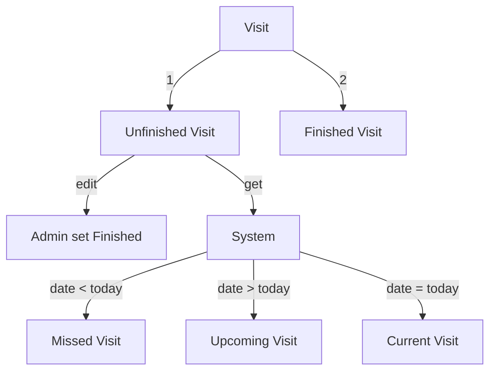

```mermaid
graph TD;
    A[Visit] -->|1| B[Unfinished Visit]
    A -->|2| C[Finished Visit]
    B -->|edit| D[Admin set Finished]
    B -->|get| E[System]
    E -->|date < today| F[Missed Visit]
    E -->|date > today| G[ Upcoming Visit]
    E -->|date = today| H[Current Visit]
 

```